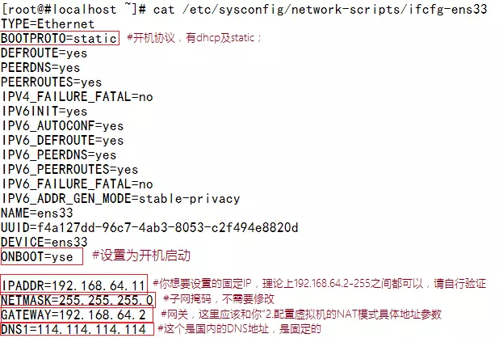

### 1.关闭防火墙
```
systemctl stop firewalld.service #停止firewall
systemctl disable firewalld.service #禁止firewall开机启动
```

### 2.配置网关
```
vi  /etc/sysconfig/network
```
NETWORKING=yes #表示系统是否使用网络，一般设置为yes。

HOSTNAME=centos #设置本机的主机名，这里设置的主机名要和/etc/hosts中设置的主机名对应

GATEWAY=192.168.1.1 #设置本机连接的网关的IP地址。

### 3.配置ip地址
```
vi /etc/sysconfig/network-scripts/ifcfg-ens*
```
注意*号为本地实际编号，如ens33



### 4.设置主机名
```
vi /etc/hostname 
```
#修改localhost.localdomain为'host000'

### 5.配置hosts
```
vi /etc/hosts #编辑配置文件
```
127.0.0.1   localhost 

添加其他节点的ip：

192.168.x.101   host001  
192.168.x.102   host002  
192.168.x.103   host003  

### 6.关闭SELINUX
```
 vi /etc/selinux/config
```
SELINUX=disabled

安全增强型Linux（Security-Enhanced Linux）简称SELinux，它是一个 Linux 内核模块，也是Linux的一个安全子系统。为了避免安装过程出现各种错误，建议关闭

### 7.重启服务
```
service network restart
```
### 8.安装第三方依赖
```
yum -y install chkconfig python bind-utils psmisc libxslt zlib sqlite cyrus-sasl-plain cyrus-sasl-gssapi fuse fuse-libs redhat-lsb net-tools
```